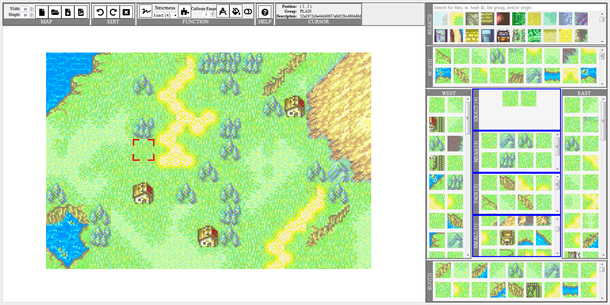

# Fire Emblem Tile Map Editor
Tile map editor for Fire Emblem GBA games.
- Fire Emblem 6: The Binding Blade
- Fire Emblem 7: The Blazing Blade
- Fire Emblem 8: The Sacred Stones

Allows users to create, modify, output and load Fire Emblem GBA maps. Features an auto-generate feature, but recommended that users manually fix it up after auto-generation.

Tile data is extracted from chapter maps of the Fire Emblem GBA games. Each tile's neighboring tiles are remembered when extracting from the chapter maps. This allows the user to know which tile can fit with another tile, as well as allow the auto-generate feature.

## GitHub Pages
https://hyssopi.github.io/temp9/

## Prerequisites
(None)

## Build
(None)

## Run
Open `index.html` in a web browser.

## Test
(None)

## Miscellaneous Details
Getting map data from the game to the Tile Map Editor.

#### Emulator
- Switch to only show `Background 3` in the emulator. This is the background layer that has the map image.
- Take screen captures of Background 3, keeping in mind that some tiles are animated and therefore has to be timed right (pause the game) when taking a screen capture.
- Some backgrounds have some overlay over it and cannot have a screen capture taken. For example: Fire Emblem 6 Chapter 08x. Has blinking red on Background 3 to simulate the fire effects.
- Some levels are fog of war which is still shown on the tiles of the maps in Background 3 layer. Therefore recommended to use Thief units with Torch item with Cheats (unit turn is always available to move).
- Some levels have parallax backgrounds. For example: Fire Emblem 6 Chapter 16x, Fire Emblem 6 Chapter 24, and Fire Emblem 6 Final Chapter.

#### GIMP
- Stitch screen captures together to form the complete map.
- Double check that maps with animated tiles are properly stitched.

#### References/Images (24-Bit Color Depth)
- Emulators such as mGBA use 24-bit color depth instead of the original GBA 15-bit color depth.
- Place completed stitched maps to the `Images (24-Bit Color Depth)` folder.

#### Map Extractor
- Inputs:
- Outputs:
  - tile/images
  - tileReferences.json

- Update `ALL_TILE_HASHES` in `tileSortHelperStyle1.html` with the output `tileHashesSortedByColor.txt`.
- Update `TILE_GROUP_INPUT_OPTIONS` in both `tileSortHelperStyle1.html` and `tileSortHelperStyle2.html` with the list of groups from the Map Extractor Runner command prompt output.
- The output `tileHashesByMapScript.txt` is not used.

#### Tile Sort Helper
- Style1
  - Displays the tiles based on `group`. Clicking tiles on the right will move it to the left. Tiles on the left are used to generate a batch script to move the tile images to the new specified group.
  - For example, choosing `UNDEFINED` as the input will display all the UNDEFINED tile images in the UNDEFINED folder. Clicking on tiles on the right will move it to the left. Then choosing `FLOOR` as the output group will update the batch move script. Copy the batch script into a command prompt to move the tile images from `UNDEFINED` to `FLOOR`.
  - Not recommended to use this style. Better to use Style2.
- Style2
  - Load map JSON file (for example, `References\Fire Emblem Map JSON Files\Fire Emblem 6\Chapters\07\001.png.json`). Display the tiles of the map on top. Clicking on tiles on the top will move it to the bottom. Tiles on the bottom and the output radio button group are used to generate a batch script to move the tile images to the new specified group. Any changes should automatically copy the batch move script output to clipboard. Execute it by pasting into the command prompt to move the tile images.
  - Any tiles that are not in the UNDEFINED folder (meaning they have been sorted), will be replaced with an EMPTY tile.
  - Use the Emulator with the game and chapter running as a reference when sorting.

#### Map Extractor
- Execute Map Extractor Runner again to update any sorting changes from the `Tile Sort Helper`.
